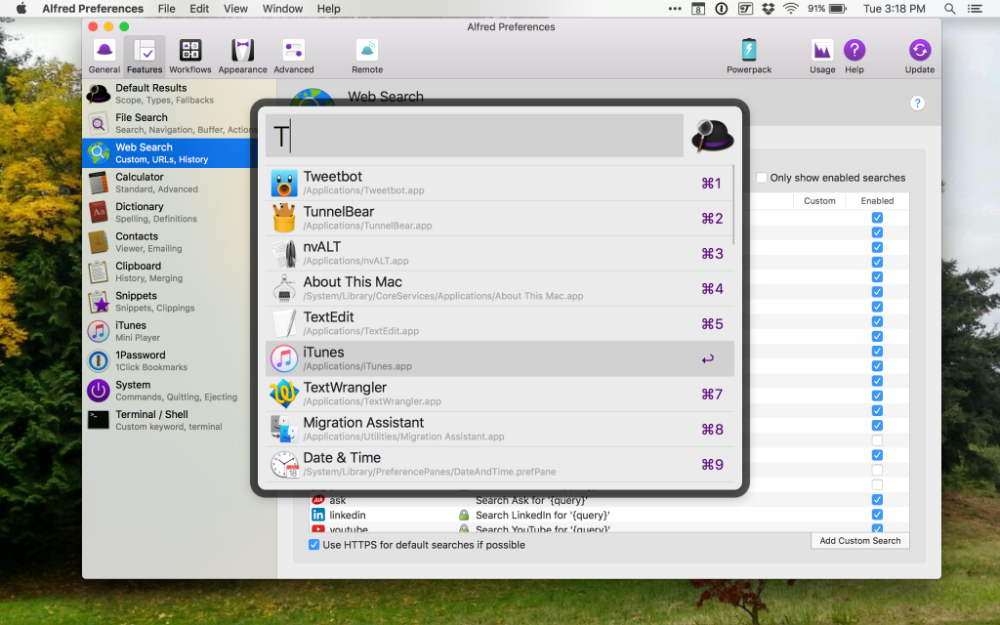

A couple of months ago I came across [Alfred 3.0 for macOS](https://www.alfredapp.com).

> Alfred is an award-winning app for macOS which boosts your efficiency with hotkeys, keywords, text expansion and more. Search your Mac and the web, and be more productive with custom actions to control your Mac.

Since I’ve never used a launcher, it took awhile to get used to doing things with the keyboard rather than the mouse. It also took awhile to learn all the things I could do using Alfred.

Alfred is free to use. There’s a paid Power Pack available for advanced users. I’m using the free version and so far it does everything that I would want it to.

**With Alfred free features you can:**

1.  Launch apps without using launchpad or the dock
2.  Search and open files without using finder
3.  Search the web without having to open the browser first
4.  Do calculations without having to open Calculator
5.  Lookup the spelling and definition of words without having to open the Dictionary
6.  You can run systems commands directly from the keyboard

My most used features are: Launching apps right from the keyboard. No more using the dock or searching for apps in the launchpad. Running all system commands from the keyboard. The System Commands keywords allow me to tell my Mac to perform an action without having to use the mouse to find a menu.

-   Show Trash
-   Empty Trash
-   Log Out
-   Sleep
-   Sleep Displays
-   Lock
-   Restart
-   Shut Down
-   Hide (applications)
-   Quit (applications)
-   Force Quit (applications)
-   Quit All (applications)
-   Eject (Local Mounted Volumes)
-   Eject All

As I mentioned, [Alfred 3 is free](https://www.alfredapp.com). Give it a try.