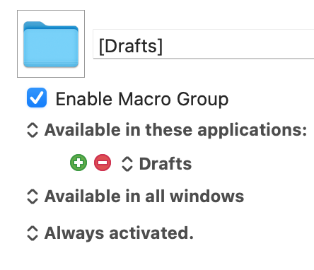
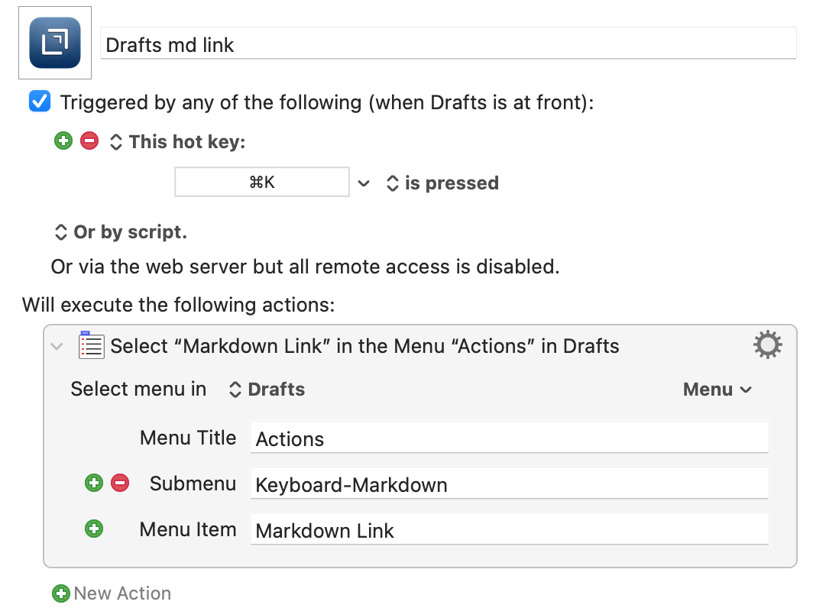

Lately, I’ve been doing more of my writing in [Drafts](https://getdrafts.com). One thing that I miss is a keyboard shortcut for a markdown link. In other writing apps like iA Writer, Byword, Ulysses, and etc, ⌘K is the keyboard shortcut for a markdown link. Since I use links fairly often I miss not having it when I’m writing in Drafts.

I solved this by creating a [Keyboard Maestro](https://www.keyboardmaestro.com/main/) macro for ⌘K to insert a markdown link when I’m writing in Drafts. Now when I press ⌘K in Drafts I get the markdown link syntax \[\]().

Here’s the macro setup:

First, you have to create a Drafts group. When you do this be sure to set Available in these applications: to Drafts.

Now the macro:

