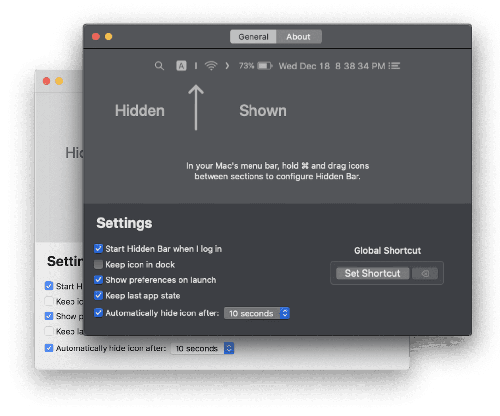

Hey, friends! I’ve been a long-time user of Mac [Bartender](https://www.macbartender.com/), an application for macOS that helps you organize and customize your menu bar, simplifying the management of icons and notifications for a cleaner and more efficient desktop experience.

With macOS Sonoma, upgrading from Bartender version 4 to the new version 5 is necessary. While I don’t mind paying for the upgrade, each iteration of Bartender adds features that I don’t find necessary, and the same holds true for version 5. So, as I said, I don’t mind the upgrade cost, but the app now offers more features than I actually need. That’s why I’m giving [Hidden Bar from Superbits](https://superbits.co/hidden/), a simpler solution, a try. In the end, it provides the basic features I need and nothing more.

