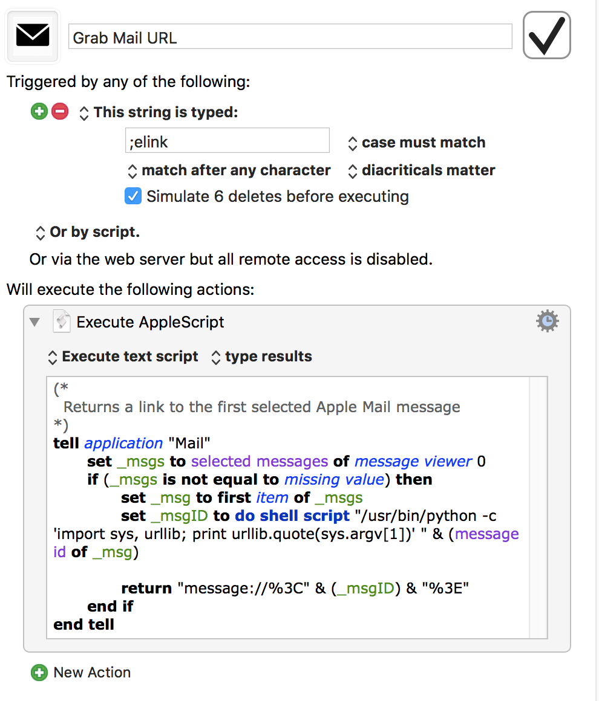

[This post](https://www.macsparky.com/blog/2019/2/applescript-to-link-to-apple-mail-message) by David Sparks aka MacSparky from a couple of days ago provides an Apple Script that he uses to get links to Apple Mail messages anywhere using TextExpander.

It’s easy to understand and there’s also a video that shows you how and why you would want to use it.

After reading the post and watching the video I decided that this would be something that I would use. Only one problem. I don’t use TextExpander. So after thinking about it for a few minutes, I figured I could accomplish the same thing using a Keyboard Maestro macro.

Here’s the macro:



This Keyboard Maestro macro works the same way as David’s TextExpander snippet. Now type “;elink” in any app that can take a URL and you create a link to the currently selected email message. I’m primarily using it in Things 3 and Bear.

Here’s the AppleScript if you want to copy and paste it:

```
(*
  Returns a link to the first selected Apple Mail message
*)
tell application "Mail"
  set _msgs to selected messages of message viewer 0
  if (_msgs is not equal to missing value) then
    set _msg to first item of _msgs
    set _msgID to do shell script "/usr/bin/python -c 'import sys, urllib; print urllib.quote(sys.argv[1])' " & (message id of _msg)

    return "message://%3C" & (_msgID) & "%3E"
  end if
end tell
```