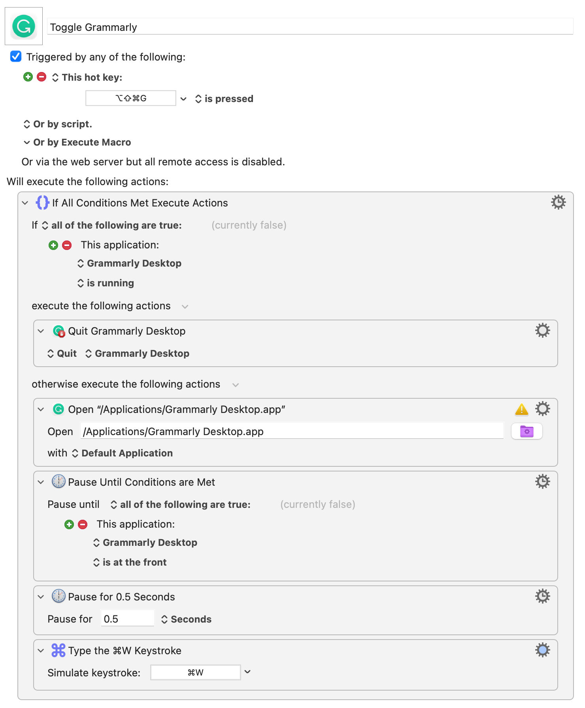

I didn’t realize that [Grammarly now has a desktop app for Mac](https://www.grammarly.com/desktop) until I ran across this post by [timstringer on the Mac Power Users forum](https://talk.macpowerusers.com/t/grammarly-now-supports-native-mac-apps/26304)

> With the recent addition of Grammarly Desktop 44, Grammarly can now be used in many native Mac apps. This is something I’ve been wanting for years. It’s great that it’s arrived and is so widely supported!

> So far, I’ve successfully used Grammarly in Mail, Notes, Pages, Keynote, Drafts, and Ulysses. Works like a charm!

In addition to working with the above-mentioned apps, I can confirm that it also works with [iA Writer](https://ia.net/writer). I’m also told that it works with Obsidian and Slack.

[tim has also written an on/off toggle](https://talk.macpowerusers.com/t/grammarly-now-supports-native-mac-apps/26304/9) macro in [Keyboard Maestro](https://www.keyboardmaestro.com/main/) which comes in handy.

> While I appreciate having access to Grammarly across many of my apps, I don’t always need to be checking my spelling and grammar.

> I created a simple Keyboard Maestro macro (tied to ⌥⇧⌘G) that toggles Grammarly. This way I can easily fire up Grammarly when I need its services and shut it down if it’s getting in the way or is not needed. This macro also automatically closes the window that is displayed when Grammarly launches.

