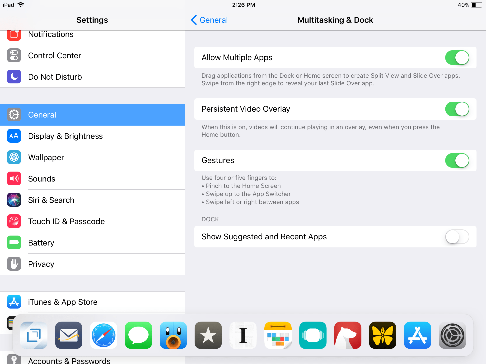

One of the things that I like about iOS 11 on my new iPad is the ability to add up to 13 apps to the dock. By default, the dock also has a Suggested and Recent apps section at the right end of the dock. This shows my 3 most recently used apps, not including apps that are already in the doc.

This is probably handy for most folks but I would rather not see the Suggested and Recent apps. After doing some poking around I found that this can be turned off in settings. Here’s how to turn it off. Go to **Settings > General > Multitasking & Dock > Show Suggested and Recent Apps** and toggle it off.

