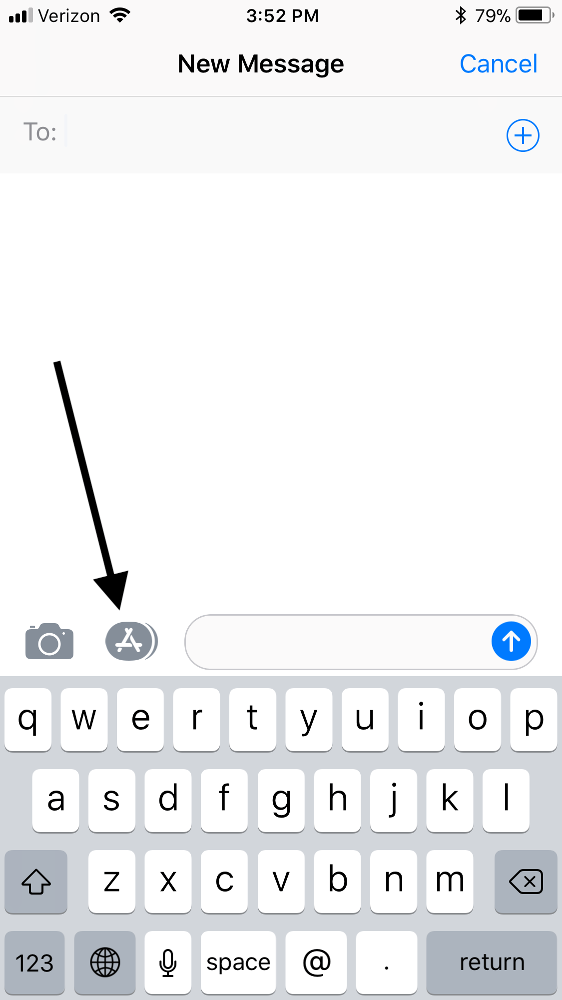

I’m not into iMessage apps. So after updating my iPhone to iOS 11 and seeing a row of brightly colored app icons at the bottom of Messages ticked me off. Since I never use the iMessage apps they were distracting and a waste of screen space. How to get rid of it? It took me a few days but after doing some poking around I stumbled upon a way to get rid of the app icon row.

The method for hiding the icon row is not obvious and there’s no setting for it in the Messages app Settings. Hiding and showing the iMessage app row is in the Messages app itself. To show or hide the app icon row tap App Store icon next to the message entry field.

