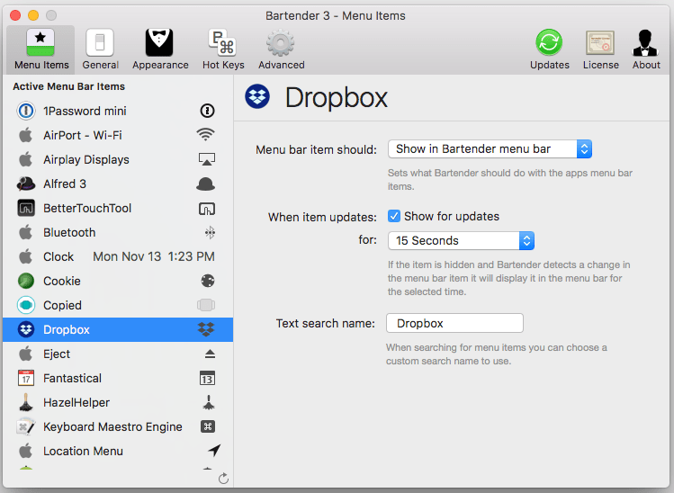

I have collected my share of menu bar utility apps on my Macs. Some of them I like to see all the time and others I only need to see occasionally or not at all. [Bartender 3](https://www.macbartender.com/) lets me organize my menu bar apps by hiding them, rearranging them, or moving them to the Bartender Bar.

I also like that I can place an app in the Bartender Bar but any time the app updates the icon will appear in the main menu bar. An example this would be the way I’ve configured Dropbox. I have it set to be in the Bartender Bar but anytime it updates the icon will show in the main menu bar for 15 seconds.

If you want to cleanup your menu bar give Bartender a try. You can download a 4 week trial [here](https://www.macbartender.com/).