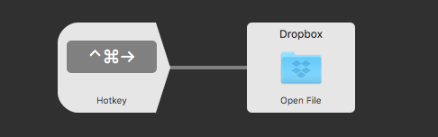

This is Part 4 of [how I use Alfred](https://ldstephens.net/2018/01/16/all-the-ways-im-using-alfred-app-on-my-mac/).

The default way to open files or folders on the Mac is with Finder. Using [Alfred](https://www.alfredapp.com/) I’m able to launch files and folders with fewer mouse clicks. I do this with Alfred’/s Quick File Search. I activate Alfred tap the space bar and start typing the name of the file or folder I’m looking for. I also use Alfred to navigate through my Mac’s file system. To start, I type: / (slash) to go to the root folder on my Mac, or ~ (tilde) to go to my user directory. This is a great way to quickly make my way through folders without using the Finder and my mouse.

For my most often used folders I’ve created a workflow that lets me open them with keyboard shortcuts. For example ⌃⌘ right arrow will open my Dropbox folder.

I find that using Alfred to search and launch files and folders to be much more productive than using the Finder.