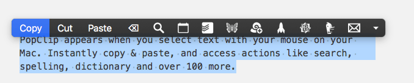
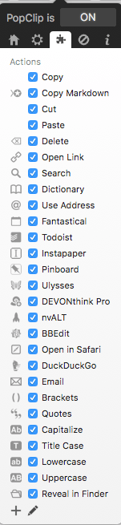
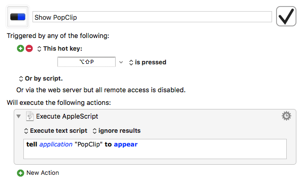

[PopClip](https://itunes.apple.com/us/app/popclip/id445189367?mt=12&uo=4&at=1000lude) is one of my favorite Mac utilities.

PopClip is a Mac utility for working with selected text. When I highlight text with my mouse or trackpad an actions menu pops up with options to do something with the text. I don’t have to right-click, it just appears automatically. And if I don’t use it, it’ll disappear when I move my mouse.

PopClip includes standard actions like copy, cut, paste, and delete. There are also extensions to get the highlighted text into some of my favorite apps. Another action I frequently use is taking highlighted text and converting it to markdown. There are over 100 extensions that can be downloaded from the [PopClip download site](https://pilotmoon.com/popclip/extensions/).

The only problem with PopClip is that occasionally the menu doesn’t appear when I make a selection or I’ll sometimes accidentally dismiss it. When this happens I have to re-select the text to get the menu back again. That’s a pain. Thanks to [Brett Terpstra there’s a simple script](http://brettterpstra.com/2014/11/17/invoking-popclip-on-an-existing-selection/) to get the menu to appear. To solve this problem, I’ve set the script to a Keyboard Maestro hotkey trigger ⌥⇧P so I can get the menu to appear anytime I want.

Here’s the Keyboard Maestro macro:

