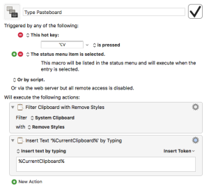

I discovered the plain text paste [Keyboard Maestro](https://www.keyboardmaestro.com/main/) macro on [tjlouma’s GitHub page](https://github.com/tjluoma/keyboard-maestro-plain-paste).

> Here’s what it does:
> 
> 1.  Remove any formatting from the clipboard.
> 2.  Inserts the clipboard text by typing.
> 
> Here are a few of the scenarios when this comes in handy:
> 
> -   any time you want to ‘paste’ text but do not wanted any formatting kept
> -   any time you are faced with a text field that does not respond to a ⌘ + V (paste) command
> -   any time you need to enter a phone number into one of those stupid web-forms that uses three different fields for a phone number (area code + prefix + suffix) where you can’t use ‘paste’ because it will put all of the digits into the first box

I use this keyboard shortcut almost every day. I use it when I know I don’t want formatting and am not sure if where I’m pasting will keep the formatting or not. I use it to login into websites or apps that don’t allow pasting. For example you can’t login into an encrypted disk image by pasting. It’s not allowed. So instead of typing your password copy it to the clipboard and past it in using ⌥V.

You can download the Keyboard Maestro macro [here](https://github.com/tjluoma/keyboard-maestro-plain-paste), courtesy of tjlouma at Github. tjlouma has a bunch of other Keyboard Maestro macros available on his Github account as well.