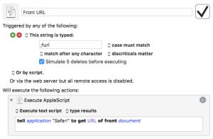

I read all of David Sparks [MacSparky](https://www.macsparky.com) blog posts. [This post](//www.macsparky.com/blog/grab-safari-link) by David Sparks from a few days ago caught my interest. It provides a useful utility for getting URLs from Safari. I followed David’s instructions and created the [Keyboard Maestro](https://www.keyboardmaestro.com/main/) macro. For the life of me, I couldn’t get it to work. It would always stall at ⌘L. Safari would give me a drop down with “Top Hit”. I finally emailed David for some help. It took David a few days to get back to me so in the mean time I started to research this on the web.

A few days later Dr. Drang over at [leancrew.com](http://leancrew.com) [wrote a response](http://leancrew.com/all-this/2017/04/getting-urls-from-safari/) to David’s post on his blog. His post offered a different way of doing the same thing. I tried Dr. Drang’s method and it worked perfectly.

Here’s Dr. Drang explaining what his macro does.

> The utility is a Keyboard Maestro macro that gets the URL of the active tab in Safari, puts it on the clipboard, and then pastes it into whatever text you happen to be working on. I’ve been using a utility similar to it for almost a decade, and I can’t tell you how much time it’s saved me. You may think it’s no big deal to do “by hand” what this macro automates, and if you’re the kind of person who almost never sends links via Twitter or Facebook or texting, you might be right. But if you do much web communication, you’ll want to use David’s macro. Or something similar to it.

> As it happens, the utility I currently use for this is also a Keyboard Maestro macro, but it has a long and convoluted history. It started out as a Python script (for absolutely no good reason, as most of what it did was run AppleScript) that was triggered by Quicksilver. Remember Quicksilver? Those were the days… Then I converted it to a TypeIt4Me snippet that ran a short AppleScript. Then I switched it to a TextExpander snippet that ran basically that same AppleScript. Finally, it became the Keyboard Maestro macro I use today:

Dr. Drang also has a KM macro ;surl which puts up a window with a list of all the tabs in the front Safari window, from which you can select the tab whose URL you want. You can find both macros [here](http://leancrew.com/all-this/2017/04/getting-urls-from-safari/).

I use these two macros almost every single day. Thank you Dr. Drang for the post.
