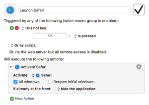

By using keyboard shortcuts to launch apps on my Mac, I can cut back on mouse or trackpad usage to perform actions faster and more efficiently. In fact, the Dock on both my Macs is hidden. I launch all my most popular apps using keyboard shortcuts.

I’ve created my keyboard shortcuts using [Keyboard Maestro](https://www.keyboardmaestro.com/main/). Within Keyboard Maestro I have a Group called Launch Apps. All my app launcher macros live there. Here’s how to create the app launcher macro:

Repeat this for all the apps that you would like to launch using a keyboard shortcut.

If you create the macro the way I have, the hotkey will also show/hide the app once launched.