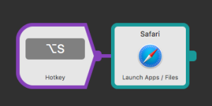
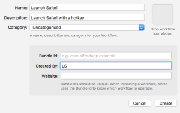
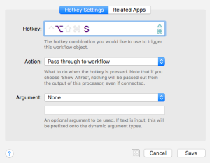
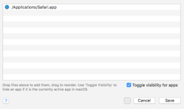

The other day I [wrote about launching Mac apps with keyboard shortcuts](http://ldstephens.net/2017/06/20/launch-your-favorite-apps-with-keyboard-shortcuts-keyboard-maestro/) using [Keyboard Maestro](https://www.keyboardmaestro.com/main/). If you’re an [Alfred](https://www.alfredapp.com/) user you can do the same thing with an Alfred workflow.

Here’s my workflow to launch Safari with the hotkey ⌥S. You’ll need the [PowerPack](https://www.alfredapp.com/powerpack/) to do this.

Step one is to create a new workflow.

Step two is to setup a trigger for the hotkey.

Step three is to add the Launch Apps action and drag in the application(s) you want to open. The easiest way to do this is to search for the application or file in Alfred and drag it directly from Alfred’s results into the action box.

Optionally, check the “Toggle visibility for apps” to tell Alfred to show/hide the app. Connect the action to the hotkey to quickly launch the app.

I prefer launching apps with Alfred for one main reason. I like the way the show/hide app functionality works in Alfred better than the way it does in Keyboard Maestro.