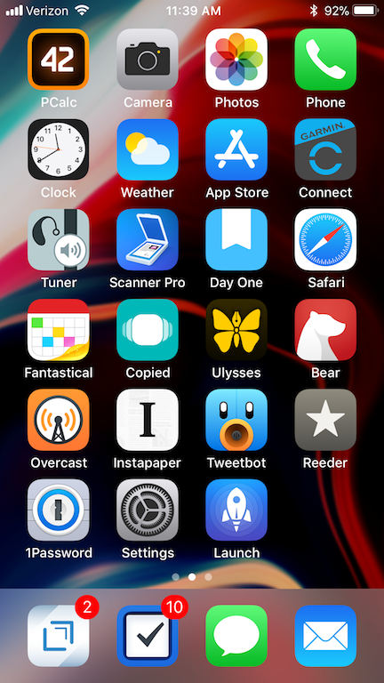
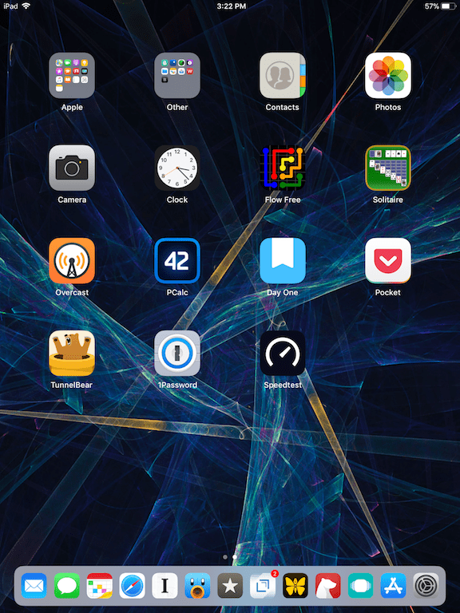

[My Must-Have Mac and iPhone Apps for 2017](https://ldstephens.net/2017/01/04/my-must-have-mac-and-iphone-apps-web-services-for-2017/) was one of my most popular posts. In making this a tradition I’m sharing my 2018 must have apps in hopes you’ll discover a new app or two that will improve your workflow or make you more productive.

During 2017 I tried a lot of different apps. Some I liked and switched to, others I tried and didn’t like and stayed with what I’d been using. Having the right app for the right task on the right device is key to my productivity.

You can find **[My 2018 Must-Have Mac Apps here](https://ldstephens.net/2017/12/26/my-2018-must-have-mac-apps/)**.

## My iPhone and iPad setup:

My iPhone is a 32 GB Silver 7 Plus. It’s my first plus size iPhone and I love it.

My iPad is a 2017 9.7” with Retina display with 128 GB of storage. It’s used primarily for reading, email, checking Twitter, web browsing, and occasionally for writing.

### Here’s my software and what I use it for:

**Safari  
**Safari is my browser on iOS.

**Mail.app  
**[Fastmail](https://www.fastmail.com/?STKI=14726057) IMAP works flawlessly with the stock mail.app.

**Messages  
**Messages is for messaging with my friends and family.

**[Things 3](https://itunes.apple.com/us/app/things-3/id904237743?mt=8&uo=4&at=1000lude)  
**Things 3 is for task management and reminders. I love the simplicity of how it works. I wrote an article about it [here](https://ldstephens.net/2017/10/17/things-3-for-personal-task-management/).

**[Fantastical 2  
](https://itunes.apple.com/us/app/fantastical-2-for-iphone-calendar/id718043190?mt=8&uo=4&at=1000lude)**Fantastical is my calendar app. It’s where I keep all my appointments and some reminders.

**[Bear  
](https://itunes.apple.com/us/app/bear-beautiful-writing-app/id1016366447?mt=8&at=1000lude)**Bear is my notes and lists app. I’ve been a pro user since the inception of the app. It’s beautiful to work in, search is excellent and I’ve never had a sync issue.

**[Drafts  
](https://itunes.apple.com/us/app/drafts-quickly-capture-notes/id905337691?mt=8&uo=4&at=1000lude)**Drafts is my multi-purpose writing and note taking app. I use it as the first stop for most everything I write and use its extensibility to send it anywhere. It has a customizable keyboard, which allows me to add one button actions. Then there are an array of export actions once I finish creating. I’ve written about how I use Drafts [here](https://ldstephens.net/2017/03/31/getting-drafts-right/).

**[Ulysses  
](https://itunes.apple.com/us/app/ulysses/id1225571038?mt=8&uo=4&at=1000lude)**Ulysses is the app I use to write my stories. I’ve had a love-hate relationship with it since it went subscription. During the year I tried other writing apps but none compares with Ulysses. I do most all my writing on my Mac so it’s rarely used on my iPhone and iPad other than for a quick add to one of my stores or for the share sheet.

**[Copied  
](https://itunes.apple.com/us/app/copied-copy-paste-everywhere/id1015767349?mt=8&uo=4&at=1000lude)**Copied is my cross-platform clipboard history manager. I’ve written about it [here](https://ldstephens.net/2017/02/13/my-favorite-clipboard-manager-for-ios-and-macos/).

**[Day One Journal  
](https://itunes.apple.com/us/app/day-one-journal/id1044867788?mt=8&uo=4&at=1000lude)**Day one is for keeping a life log of things that go on in my life.

**[Reeder  
](https://itunes.apple.com/us/app/reeder-3/id697846300?mt=8&uo=4&at=1000lude)**Reeder is my newsreader for my **[Feedly](https://feedly.com/i/welcome)** RSS feeds.

**[Tweetbot  
](https://itunes.apple.com/us/app/tweetbot-4-for-twitter/id1018355599?mt=8&uo=4&at=1000lude)**Tweetbot is for reading my Twitter feed.

**[Instapaper  
](https://itunes.apple.com/us/app/instapaper/id288545208?mt=8&uo=4&at=1000lude)**Instapaper is my read it later service. I wrote an article about my Instapaper workflow [here](https://ldstephens.net/2017/09/06/my-instapaper-workflow/).

**[Overcast  
](https://itunes.apple.com/us/app/overcast-podcast-player/id888422857?mt=8&uo=4&at=1000lude)**Overcast is where I listen to podcasts.

**[1Password  
](https://itunes.apple.com/us/app/1password/id568903335?mt=8&uo=4&at=1000lude)**1Password is my password manager.

**[Launch Center Pro  
](https://itunes.apple.com/us/app/launch-center-pro-shortcut/id532016360?mt=8&uo=4&at=1000lude)**Launch Center Pro is for launching actions in a single tap.

**[PCalc  
](https://itunes.apple.com/us/app/pcalc-the-best-calculator/id284666222?mt=8&uo=4&at=1000lude)**PCalc is my stock calculator replacement. I use it for its additional features and customization.

**[Scanner Pro  
](https://itunes.apple.com/us/app/scanner-pro/id333710667?mt=8&uo=4&at=1000lude)**Scanner Pro allows me to scan paper documents into PDFs that look clean and professional.

**[TunnelBear VPN  
](https://itunes.apple.com/us/app/tunnelbear-vpn/id564842283?mt=8&uo=4&at=1000lude)**TunnelBear is my VPN for security on public WiFi and web browsing privacy.

**[Garmin Connect  
](https://itunes.apple.com/us/app/garmin-connect/id583446403?mt=8&uo=4&at=1000lude)**Connect is for recording and tracking my cycling and running activities.