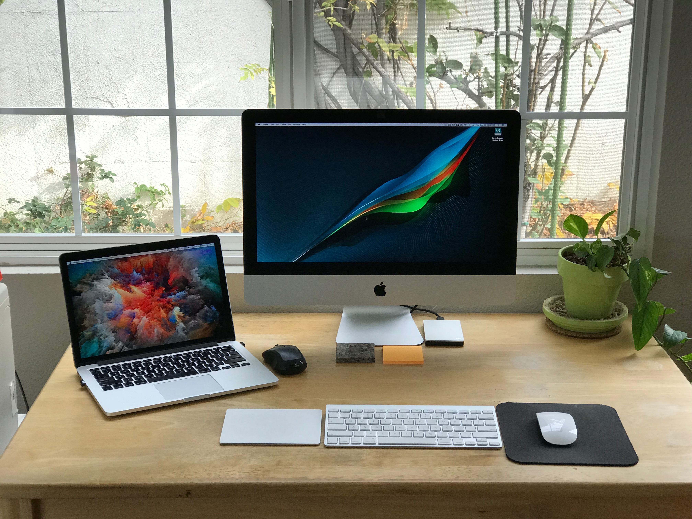

[My Must-Have Mac and iPhone Apps for 2017](https://ldstephens.net/2017/01/04/my-must-have-mac-and-iphone-apps-web-services-for-2017/) was one of my most popular posts. In making this a tradition I’m sharing my 2018 must have apps in hopes you’ll discover a new app or two that will improve your workflow or make you more productive.

During 2017 I tried a lot of different apps. Some I liked and switched to, others I tried and didn’t like and stayed with what I’d been using. Having the right app for the right task on the right device is key to my productivity.

You can find **[My 2018 Must-Have iOS Apps  for iPhone and iPad here](http://ldstephens.net/2017/12/27/my-2018-must-have-ios-apps-for-iphone-and-ipad/)**.

## My Mac setup:

I have two Macs. A late-2013 21.5” iMac and an early-2015 13” Retina MacBook Pro.

### Here’s my software and what I use it for:

**Safari  
**Safari is my browser of choice. It just works best on macOS. I use [Firefox Quantum browser](https://www.mozilla.org/en-US/firefox/) when a site doesn’t play nice with Safari.

**[Fastmail  
](https://www.fastmail.com/?STKI=14726057)**I’ve been using Fastmail as my email service for over 2 years. It’s been a great Gmail replacement. I recently wrote about Fastmail [here](https://ldstephens.net/2017/04/17/two-years-of-fastmail-and-how-it-replaced-gmail/).

**[Things 3  
](https://itunes.apple.com/us/app/things-3/id904280696?mt=12&uo=4&at=1000lude)**I recently started using Things 3 for task management and reminders. I love the simplicity of how it works. I wrote about it [here](https://ldstephens.net/2017/10/17/things-3-for-personal-task-management/).

**[Fantastical 2  
](https://itunes.apple.com/us/app/fantastical-2-calendar-reminders/id975937182?mt=12&uo=4&at=1000lude)**Fantastical is my calendar app. It’s where I keep my appointments and some reminders. I love that I can use natural language to quickly create events and reminders.

**[Bear  
](https://geo.itunes.apple.com/us/app/bear-beautiful-writing-app/id1091189122?mt=12&at=1000lude)**Bear is my notes and lists app. I’ve been a pro user since the inception of the app. It’s beautiful to work in, search is excellent and I’ve never had a sync issue.

**[Ulysses  
](https://itunes.apple.com/us/app/ulysses/id1225570693?mt=12&uo=4&at=1000lude)**Ulysses is the app I use to write my stories. I’ve had a love-hate relationship with it since it went subscription. During the year I tried [Byword](https://itunes.apple.com/us/app/byword/id420212497?mt=12&uo=4&at=1000lude), [iA Writer](https://itunes.apple.com/us/app/ia-writer/id775737590?mt=12&uo=4&at=1000lude) and [MultiMarkdown Composer](https://itunes.apple.com/us/app/multimarkdown-composer-4/id1275176220?mt=12&uo=4&at=1000lude) but none compares with Ulysses.

**[Marked 2  
](https://itunes.apple.com/us/app/marked-2/id890031187?mt=12&uo=4&at=1000lude)**Marked is the markdown previewer app I use side by side with Ulysses.

**[Grammarly](https://www.grammarly.com)** and **[Hemingway](http://hemingwayapp.com/)** are for proofreading my stories for grammar and punctuation.

**[Copied  
](https://itunes.apple.com/us/app/copied-copy-paste-everywhere/id1026349850?mt=12&uo=4&at=1000lude)**Copied is my cross-platform clipboard history manager. I’ve written about it [here](https://ldstephens.net/2017/02/13/my-favorite-clipboard-manager-for-ios-and-macos/).

**[MindNode  
](https://itunes.apple.com/us/app/mindnode-5/id1289197285?mt=12&uo=4&at=1000lude)**I don’t use mind maps often but when I do MindNode is where I do it.

**[Reeder  
](https://itunes.apple.com/us/app/reeder-3/id880001334?mt=12&uo=4&at=1000lude)**Reeder is my newsreader for my **[Feedly](https://feedly.com/i/welcome)** RSS feeds.

[**Tweetbot**  
](https://itunes.apple.com/us/app/tweetbot-for-twitter/id557168941?mt=12&uo=4&at=1000lude)Tweetbot is for reading my Twitter feed.

**[Instapaper  
](https://www.instapaper.com/)**Instapaper is my read it later service. I wrote an article about my Instapaper workflow [here](https://ldstephens.net/2017/09/06/my-instapaper-workflow/).

**[Alfred  
](https://www.alfredapp.com)**Alfred is Spotlight on steroids. I’d be lost without it. Alfred is my launcher, search interface, and TextExpander replacement. It is a free app. You should definitely give it a try if you’re not already using it.

**[Keyboard Maestro  
](https://www.keyboardmaestro.com/main/)**Keyboard Maestro is another productivity app that I couldn’t live without. I use Keyboard Maestro keyboard shortcuts to launch apps, open files and folders and for automating actions. It has a learning curve but once you start to get the hang of it you can do some amazing things. Check out [Keyboard Maestro’s homepage](https://www.keyboardmaestro.com/main/) for a list of all the things you can do.

**[BetterTouchTool  
](https://www.boastr.net/)**BetterTouchTool allows me to configure gestures or keyboard shortcuts for my Magic Mouse, MacBook Trackpad, and Magic Trackpad to trigger actions like moving and resizing windows, switching tabs in Safari and more. BTT has a 45-day free trial. Give it a try.

**[Dropbox  
](https://www.dropbox.com/)**Dropbox is where I keep files that I want to have available on all my devices. It’s also where syncing happens for apps like Alfred, Keyboard Maestro, and BetterTouchTool.

**[1Password  
](https://itunes.apple.com/us/app/id1333542190?at=1000lude)**1Password is my password manager.

**[PDFpen](https://itunes.apple.com/us/app/id1359905378?at=1000lude)** and **[Hazel](https://www.noodlesoft.com/)** are key apps for my paperless workflow. I’ve written about my paperless workflow [here](https://ldstephens.net/2017/05/21/ive-gone-paperless/).

**[App Cleaner  
](http://freemacsoft.net/appcleaner/)**AppCleaner is my app uninstaller. I use it because it deletes all the junk that gets left behind when you just drag the app icon to the trash.

**[PopClip  
](http://pilotmoon.com/popclip/)**I use PopClip to manage what I do with selected text. I’ve written about PopClip [here](https://ldstephens.net/2017/09/15/how-to-open-the-popclip-menu-on-a-selection/).

**[Yoink  
](https://itunes.apple.com/us/app/yoink-improved-drag-drop-file-management/id457622435?mt=12&uo=4&at=1000lude)**Yoink speeds and up my workflow by simplifying drag and drop. I’ve written about Yoink [here](https://ldstephens.net/2017/10/04/yoink-my-favorite-drag-and-drop-utility-for-mac/).

**[Bartender 3  
](https://www.macbartender.com/)**Bartender is the app I use to organize my menu bar. I’ve written about it [here](https://ldstephens.net/2017/11/15/how-i-organize-my-mac-menu-bar-apps/).

**[ScreenFloat  
](https://itunes.apple.com/us/app/screenfloat-more-useful-screenshots/id414528154?mt=12&uo=4&at=1000lude)**ScreenFloat is my app for taking floating screenshots and storing them.

**[TunnelBear VPN  
](https://www.tunnelbear.com)**TunnelBear is my VPN for security on public WiFi and web browsing privacy.

**[f.lux  
](https://justgetflux.com/)**f.lux is for protecting my eyes and sleeping better at night.