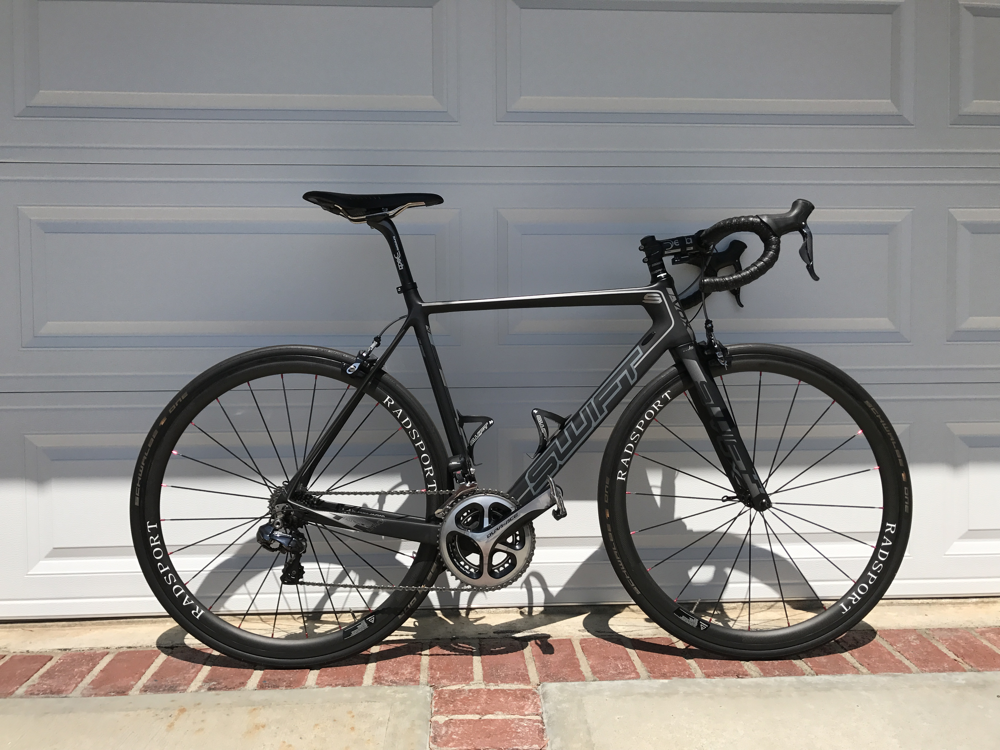

I’ve been an avid cyclist for many years. This includes endurance events as well as racing as an elite master at the State and National Level.

I stopped racing and endurance riding in 2010 after having open heart surgery to correct a severally leaking mitral valve and an enlarged atrium.

These days I ride for pleasure and staying fit. The truth is, I really just enjoy riding especially now that we live in central New Jersey. I love riding on all the open country roads.

Here’s the tech I’m using.

[Forerunner 35](https://buy.garmin.com/en-US/US/p/552962/pn/010-01689-02#overview)  
The Forerunner 35 is an easy-to-use GPS Watch with Wrist-based Heart Rate and records my daily steps, occasional runs, walks, bike rides, calories, and weight.

[Garmin Connect](https://connect.garmin.com/en-US/)  
Garmin Connect is my online training tool to store, analyze all my fitness activities. There is also a [Garmin Connect app for iOS](https://itunes.apple.com/us/app/garmin-connect/id583446403?mt=8&uo=4&at=1000lude).

[Strava](https://www.strava.com/)  
Strava is my secondary online training tool to store, analyze and _share all my fitness activities with my friends_. There is also a [Strava app for iOS](https://itunes.apple.com/us/app/strava-running-and-cycling/id426826309?mt=8&uo=4&at=1000lude). Here’s my [Profile Link](https://www.strava.com/athletes/lorenstephens).

Living in California my tech was the same winter or summer because in California it’s always summer. But now that we live in New Jersey that’s all changed. I’ll be spending a fair amount of time on my indoor trainer since the weather tends to be unpredictable in the summer and cold with snow and rain in the winter.

For those days that I’m not going to be able to get outside to ride, I’ll be using my [Kinetic T-2700](https://www.kurtkinetic.com/trainers-products/kinetic-road-machine-smart) indoor trainer with the [iOS Kinetic Fit app](https://itunes.apple.com/us/app/id1023388296?at=1000lude) for recording my activities. The Fit app shares my completed workouts with Strava but I have to manually enter them into Garmin Connect.

That’s it, folks. Reach out to me if you have any cycling related questions.