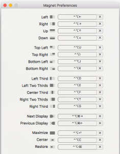
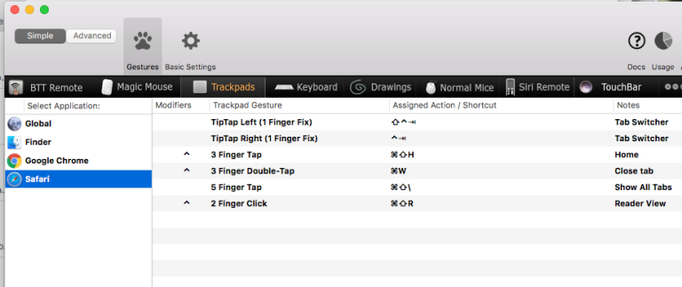

I’ve only been using [Better Touch Tool](https://www.boastr.net/) for a little over a month. In that time I’ve created a small number of gestures. The primary ones are for managing windows on my desktop. Prior to using BTT I was managing windows with [Magnet](https://itunes.apple.com/us/app/magnet/id441258766?mt=12&uo=4&at=1000lude). Magnet uses hotkeys to manage windows rather than gestures.

Here’s my dilemma. Would I rather use hotkeys or gestures to manage windows? Either way, you have to remember a gesture or a hotkey. After using both my preference is remembering and using hotkeys.

I’m a die hard Alfred and Keyboard Maestro user so using hotkeys fits my workflow better. The other advantage to using Magnet is the menubar drop down in case I forget a hotkey.

The other thing I find myself doing with BTT is accidentally executing a gesture. I have a gesture setup to quit an app. I’ve accidentally executed that while working in Safari with several tabs open. What a pain! This is less likely to happen using hotkeys.

After mulling this over for a bit I’m going to manage windows with Magnet and use BTT to trigger a few of my most used keyboard shortcuts.

As for my long term use of BTT? Well, the jury is still out.