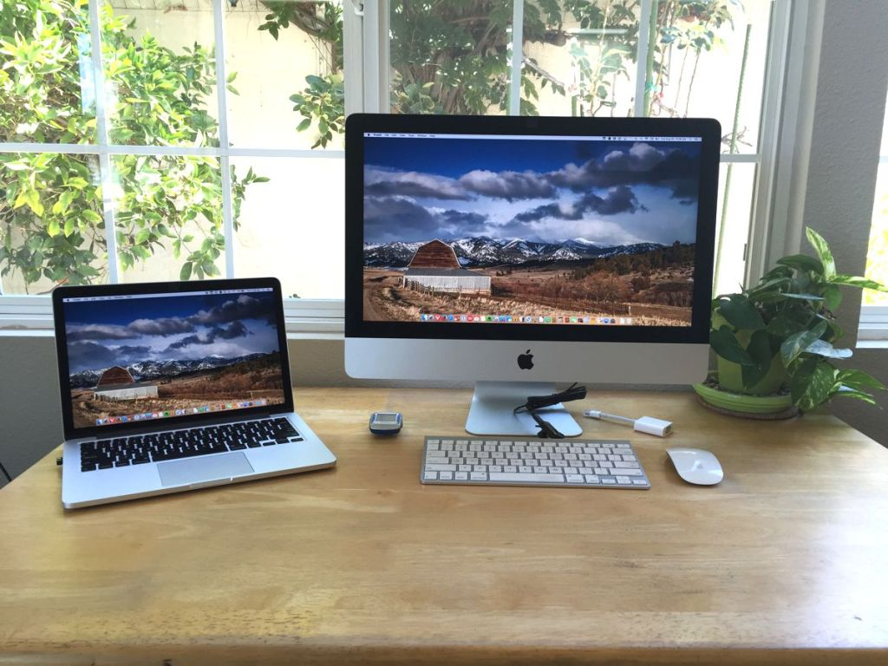
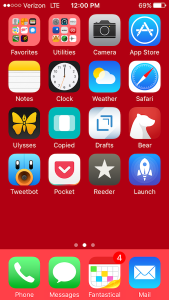

I don’t know about you, but I spend a huge chunk of time using my computer and iPhone.

I’m using my computer right now. And, as I type this story, my iPhone is just is just a few inches away.

I use these devices almost all day every day for work stuff, family stuff, writing stuff and more.

I want to share my Mac and iPhone setup with you in hopes that you’ll discover a new app that will improve your workflow or make you more productive in 2017.

### My Mac setup:

I have two Macs. My iMac is a 21.5” late-2013 model and my MacBook Pro is a Retina 13” early-2015 model. I work from home, so my iMac is my primary work machine. My MacBook is where I do most of my reading and a lot of my browsing.

### Here’s my software and what I use it for:

#### **Productivity**

-   **Safari** — is my browser of choice. It just works best on macOS for me. I’ll occasionally use Chrome when something doesn’t go right with Safari.
-   **[Fantastical 2](https://itunes.apple.com/us/app/fantastical-2-calendar-reminders/id975937182?mt=12&uo=4&at=1000lude)** — is where I keep track of all my events and reminders for both work and personal.
-   **[Bear](https://geo.itunes.apple.com/us/app/bear-beautiful-writing-app/id1091189122?mt=12&at=1000lude)** — I recently started using Bear as my notes app in place of Evernote and Apple Notes. I’ve been using it for a few months now. I upgraded to the Pro version so I would have iCloud sync across all my devices. FYI Bear is a lot like Ulysses so it would also be a good writing app if one didn’t want to pay the price of Ulysses.
-   **[Alfred](https://www.alfredapp.com)** — is a productive app I just recently discovered. It is like Spotlight on steroids. With Alfred I’m to boost my productivity with hotkeys, keywords, text expansion and much more. In fact, I like it so much I upgraded to the Power Pack. Alfred is a free. You should definitely give it a try.
-   **[Copied](https://itunes.apple.com/us/app/copied-copy-paste-everywhere/id1026349850?mt=12&uo=4&at=1000lude)** — is for managing my clipboard. Copied allows me to collect all my clipboard data and have it quickly available to use again.
-   **[Dropbox](https://www.dropbox.com/)** — is where I keep all my files, both personal and work.
-   **[1Password](https://itunes.apple.com/us/app/1password-password-manager/id443987910?mt=12&uo=4&at=1000lude)** — is for my password management. This is another must have app.
-   **[Postbox](https://www.postbox-inc.com)** — is my personal and work email client. I’ve tried many email clients and never found one that accommodated all my needs until Postbox. In my work, I send a lot of repetitive emails. What sold me on Postbox is Responses. Responses allow me to send the same message without having to type it over and over. Responses are like canned responses in Gmail.
-   **[Zoho CRM](https://www.zoho.com/crm/?src=zoho-snm)** — is a web based app where I manage all my client data.

#### **Reading**

-   **[Reeder](https://itunes.apple.com/us/app/reeder-3/id880001334?mt=12&uo=4&at=1000lude)** — is my feed reader for my [Inoreader](https://www.inoreader.com/) RSS feeds integrated with [Pocket](https://itunes.apple.com/us/app/pocket/id568494494?mt=12&uo=4&at=1000lude) for reading later.
-   **[Tweetbot](https://itunes.apple.com/us/app/tweetbot-for-twitter/id557168941?mt=12&uo=4&at=1000lude)** — is for following my Twitter feed and saving links to Pocket for reading later.

#### **Writing**

-   **[Ulysses](https://itunes.apple.com/us/app/ulysses/id623795237?mt=12&uo=4&at=1000lude)** — is the app I use to write all my stories. In fact, I’m writing this story in Ulysses right now. One of the great features of Ulysses is the ability to publish directly to WordPress and Medium right from the app.
-   **[Grammarly](https://www.grammarly.com)** — For proof reading all my stories for grammar and punctuation.

#### **Utilities**

-   **[f.lux](https://justgetflux.com/)** — to protect my eyes at night.
-   **[App Cleaner](http://freemacsoft.net/appcleaner/)** — is for uninstalling apps you no longer want. It deletes all the junk that gets left behind when you just drag the app icon to the trash.
-   **[TunnelBear VPN](https://www.tunnelbear.com)** — is for security on public WiFi and privacy while browsing.

### My iPhone setup:

I have an iPhone 6s in Space Gray. I’m currently considering an iPhone 7 Plus. I use my iPhone for all work and personal phone calls. When working I use a Jabra Bluetooth headset for hands free calling.

### Here are my apps and what I use them for:

#### **Productivity**

-   **Safari** — is my browser of choice.
-   **Mail.app** — is for my work and personal email needs.
-   **iMessage** — is for messaging my friends and family.
-   **[Fantastical 2](https://itunes.apple.com/us/app/fantastical-2-for-iphone-calendar/id718043190?mt=8&uo=4&at=1000lude)** — is where I keep track of all my events and reminders for both work and personal.
-   **[Copied](https://itunes.apple.com/us/app/copied-copy-paste-everywhere/id1015767349?mt=8&uo=4&at=1000lude)** — is for managing my clipboard.
-   **[Bear](https://itunes.apple.com/us/app/bear-beautiful-writing-app/id1016366447?mt=8&at=1000lude)** — is my note taking app.
-   **[Launch Center Pro](https://itunes.apple.com/us/app/launch-center-pro-shortcut/id532016360?mt=8&uo=4&at=1000lude)** — is my productivity app for launching actions in a single tap.

#### **Reading**

-   **[Reeder](https://itunes.apple.com/us/app/reeder-3/id697846300?mt=8&uo=4&at=1000lude)** — is my feed reader for my [Inoreader](https://itunes.apple.com/us/app/inoreader-rss-news-reader/id892355414?mt=8&uo=4&at=1000lude) RSS feeds integrated with [Pocket](https://itunes.apple.com/us/app/pocket-save-articles-videos/id309601447?mt=8&uo=4&at=1000lude) for reading later.
-   **[Tweetbot](https://itunes.apple.com/us/app/tweetbot-4-for-twitter/id1018355599?mt=8&uo=4&at=1000lude)** — is for following my Twitter feed and saving links to Pocket for reading later.

#### **Writing**

-   **[Ulysses](https://itunes.apple.com/us/app/ulysses/id950335311?mt=8&uo=4&at=1000lude)** — is on my iPhone but I rarely use it for writing. It’s there for the share sheet capability for that’s that I want to get into to Ulysses for use next time I’m writing on my Mac.
-   **[Drafts](https://itunes.apple.com/us/app/drafts-quickly-capture-notes/id905337691?mt=8&uo=4&at=1000lude)** — is for multi-purpose writing and note taking.

#### **Utilities**

-   **[TunnelBear VPN](https://www.tunnelbear.com)** — is for security on public WiFi and privacy while browsing.

#### **Fitness**

-   **[Strava](https://itunes.apple.com/us/app/strava-running-and-cycling/id426826309?mt=8&uo=4&at=1000lude)** — is for recording and tracking all my cycling activities.