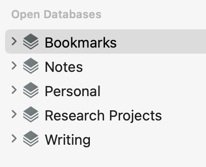

The year has just begun. A few days ago I published my [Essential Mac Apps](https://ldstephens.net/2020/12/22/my-2021-essential-mac-apps/) story and guess what? I’m making changes.

I wrote that I’m using Apple Notes for all my notes. Last week I began to have regrets. The reason, I’m uncomfortable having my notes in a proprietary database system.

I started considering other options including moving back to text files. The advantage of text files being there is no lock-in. They are more accessible and reliable. Another benefit is the ability to change client apps seamlessly. Edit one file with [iAWriter](https://ia.net/writer), edit another with [1Writer](https://1writerapp.com/), and a third with [Byword](https://bywordapp.com/). So I settled on moving my notes back to text files.

Over the holidays DEVONtechnologies put all their apps on sale at 30% off including upgrades. I took advantage of the discount and upgraded [Devonthink](https://www.devontechnologies.com/apps/devonthink) to version 3 even though I wasn’t currently using it.

After moving my notes to text files actually, .md [markdown](https://daringfireball.net/projects/markdown/syntax) files, I decided to put Devonthink to use. I indexed all my working files notes included to Devonthink. I chose indexing over importing so that the files would still be accessible in Finder.

Now, my bookmark collection, notes, personal files, research projects, and writing files are all in Devonthink.

