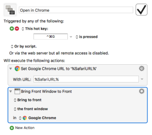

Safari is my main browser. From time to time I come across a website that doesn’t play well with Safari. When this happens I open the site in Chrome. To do this I have to copy the URL from Safari -> launch Chrome -> and paste the URL into Chrome. To many steps. To simplify this, I have a [Keyboard Maestro](https://www.keyboardmaestro.com/main/) macro to automate the steps with the hotkey ⌃⌘G.

Here’s how to create the macro:

