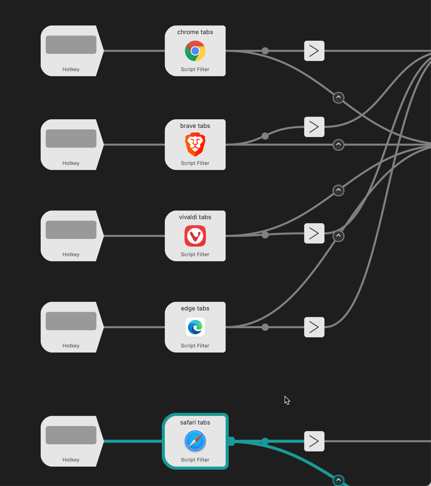

Gabe Weatherhead, writing at [MacDrifter](https://www.macdrifter.com/2021/12/safari-tab-switching.html)

> Lately I’m frustrated with Safari.
> 
> I typically have several Safari windows open, each with a different group of related tabs. When I want to switch to a specific tab it’s a tiny awkward dance of flipping through windows and then CMD-Shift-Backslash to open the Safari tab overview search. It’s not a great experience, especially if I have a Safari window in another space.
> 
> There’s a really nice solution to this problem with [using an Alfred workflow](https://github.com/epilande/alfred-browser-tabs). It’s some clever work that [uses javascript to list all of the browser tabs](https://github.com/epilande/alfred-browser-tabs/blob/main/src/list-tabs-webkit.js). It also has separate triggers to search Chrome, Brave, Edge, and something called Vivaldi.

Alfred Tab Search

I have found this [Alfred](https://www.alfredapp.com) Workflow to be particularly useful when I have lots of tabs and multiple windows open. You can download the workflow here: [https://github.com/epilande/alfred-browser-tabs](https://github.com/epilande/alfred-browser-tabs)