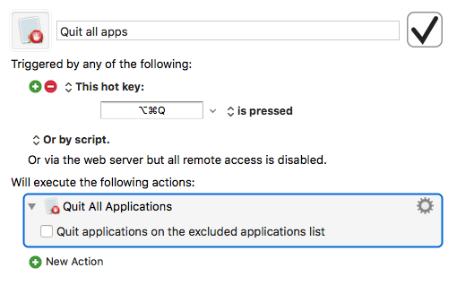
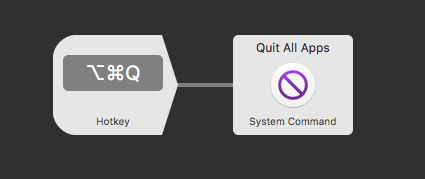

As a rule, I usually have quite a few apps and windows open on my Mac and I switch back and forth between them through out the day. When I was ready to shut my Mac down for the day I would have to close each of these apps and windows individually. I thought to myself, there has to be an easier way.

I like to automate repetitive tasks as often as possible. To solve this problem I launched [Keyboard Maestro](https://www.keyboardmaestro.com/main/) and created a macro to exit all open apps and windows using a keyboard shortcut. Here’s the simple macro I use for this.

That’s it! Now every time I type the keyboard shortcut, all open windows and applications close.

If you have [Alfred](https://www.alfredapp.com) with the Powerpack you can do the same with a workflow which you can download [here](https://ldstepblog.wordpress.com/wp-content/uploads/2017/08/quit-all-apps.zip).

