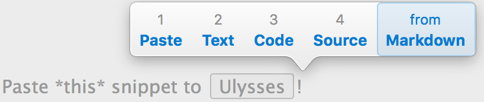

Okay, I know I’m using Ulysses again after I said I was [moving on to other options](https://ldstephens.net/2017/08/21/ulysses-subscription-update/). I’m still not happy about the subscription model but that said I’ve been gradually gravitating back to [Ulysses](https://itunes.apple.com/us/app/ulysses/id1225570693?mt=12&uo=4&at=1000lude). It just fits my writing workflow better than the other options. Smart Paste is one of the features in Ulysses for Mac that’s missing in the other options.

Smart paste lets me paste text into a sheet the way I want. It detects all the appropriate ways for pasting and lets me choose the option that fits my purpose. The hotkey to trigger for Smart Paste is ⇧-⌘-V.

All Smart Paste options are also available in the Menu under Edit › Paste as and Edit › Paste from.
