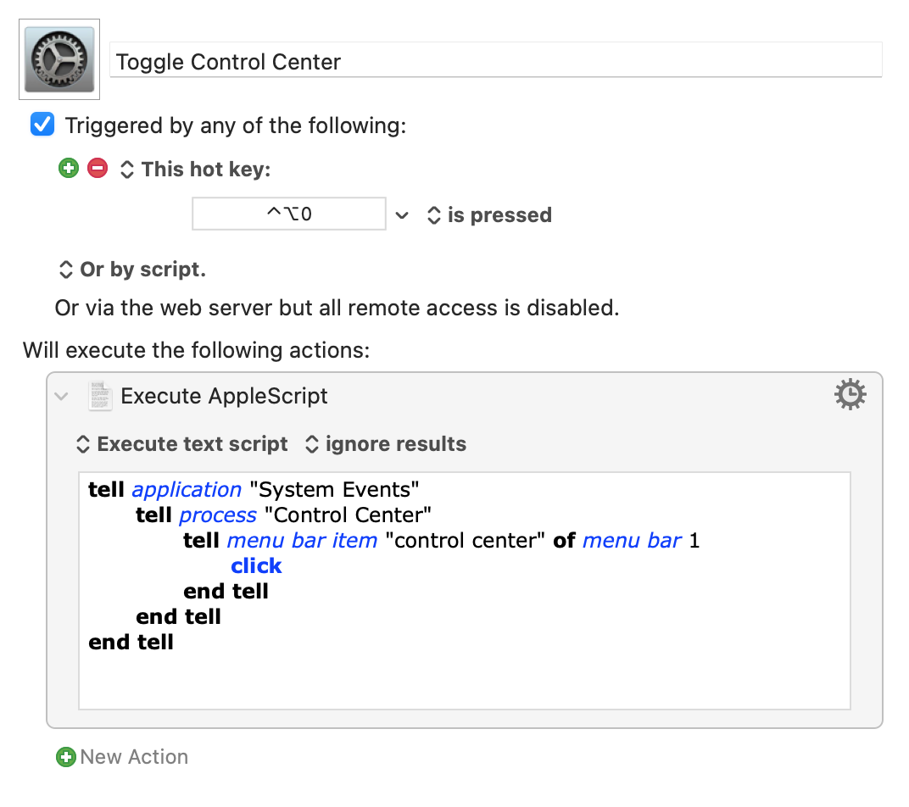

I installed [Big Sur](https://www.apple.com/macos/big-sur/) on my 2015 MacBook Pro the other day. One area that I wanted to customize was the menubar. There is so much blank space between the icons, it’s a gigantic waste of space and looks awful. Even after installing [Bartender 4](https://www.macbartender.com/Bartender4/) to organize my menubar I wanted to move some items to the Control Center for better organization.

Now that I have items in the Control Center, that used to be visible in the menubar, I’ll be accessing Control Center more frequently. Rather than clicking Control Center, I wanted a keyboard shortcut to toggle it open and closed. I did this with a Keyboard Maestro macro.



Credit [maxwellj02](https://www.reddit.com/user/maxwellj02/) for the apple script:

```
tell application "System Events"
    tell process "Control Center"
        tell menu bar item "control center" of menu bar 1
            click
        end tell
    end tell
end tell
```

By the way, my Big Sur install went perfectly and I haven’t had any issues.