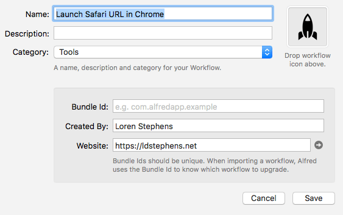

Safari is my main browser. From time to time I come across a website that doesn’t play well with Safari. When this happens I open the site in Chrome. Thanks to [Alfred](https://www.alfredapp.com/) I have a very simple way to automate this. Whenever I come across a site that isn’t working well in Safari I hit ⌥⌘G and it takes the current Safari URL and loads it in Chrome.

[Download the Alfred workflow](https://ldstepblog.wordpress.com/wp-content/uploads/2017/08/launch-safari-url-in-chrome.zip).

You can also do the same thing using [Keyboard Maestro](https://www.keyboardmaestro.com/main/) if you’re a KM user. I wrote about how to do it [here](http://ldstephens.net/2017/07/21/open-safari-url-in-chrome-keyboard-maestro/).