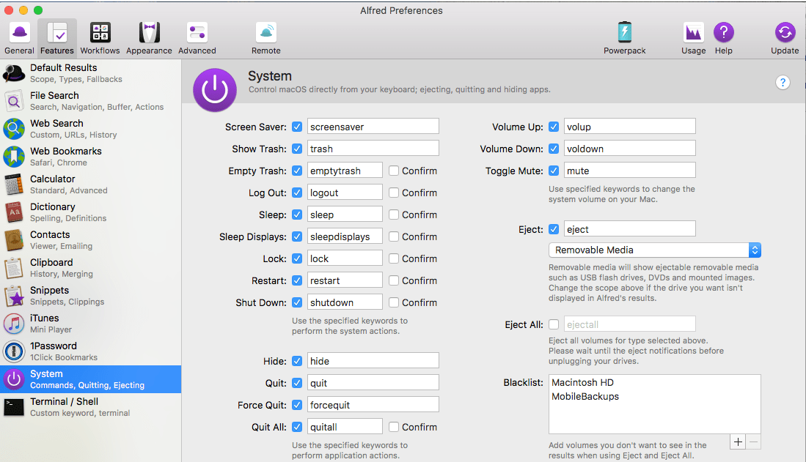
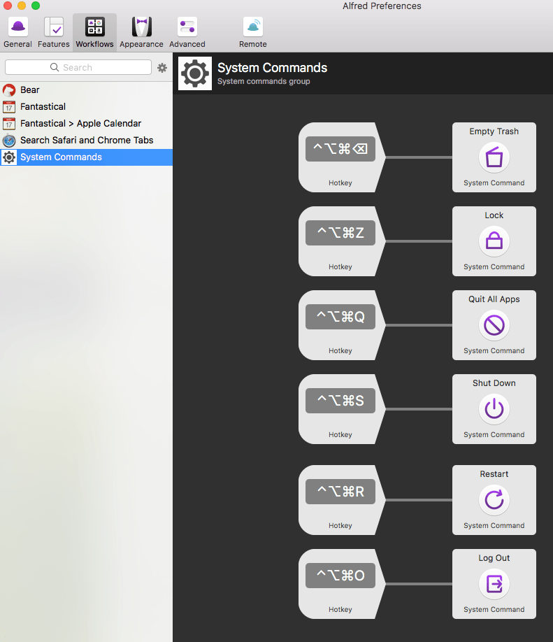

One of my most used [Alfred](https://www.alfredapp.com/) features is triggering system commands from the keyboard. This saves me a lot of mouse clicks. I can empty the trash, force quit apps, lock, logout, restart, or shutdown my Mac right from the keyboard.

The System Commands section in Settings has triggers for the most commonly used system commands.

I’ve carried this one step further. Instead of invoking Alfred and typing the trigger I’ve created hotkeys for my most often used system commands. So for example, instead of invoking Alfred and typing logout to bring up the action I use the hotkey ⌃⌥⌘O.

This is something you may want to do so you can download the workflow [here](https://ldstepblog.wordpress.com/wp-content/uploads/2017/11/ulysses-alfredworkflow.zip).​