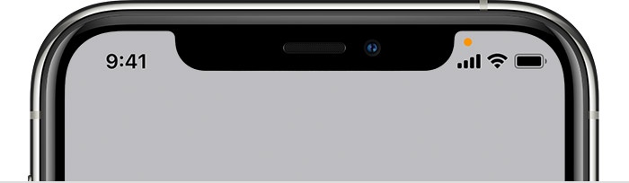

Did you know that your iPhone has a built-in privacy indicator that can help you keep your personal data safe? I didn’t until just recently. These indicator dots, which appear in the status bar at the top of your screen, let you know when an app is using your microphone, camera, or location.

What do the dots mean? Orange dot: This means that an app is currently using your microphone. Green dot: This means that an app is currently using your camera. Blue dot with white arrow: This means that an app is trying to access your location.

How to check which apps are using your data You can check which apps have recently used your microphone, camera, or location by going to **Settings** > **Privacy** > **Microphone**, **Camera**, or **Location**. This will show you a list of all the apps that have been granted permission to use these features, as well as the date and time of the last time they were used.

If you’re concerned about your privacy, you can control which apps have access to your microphone, camera, and location by going to **Settings** > **Privacy** and turning off the permissions for individual apps.

The privacy indicator dots are a valuable tool that can help you keep your personal data safe. By understanding what they mean and how to check which apps are using your data, you can take steps to protect your privacy and security.