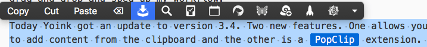

I discovered [Yoink](https://itunes.apple.com/us/app/yoink-improved-drag-drop-file-management/id457622435?mt=12&uo=4&at=1000lude) thanks to a [blog post by John Gruber](https://daringfireball.net/linked/2017/05/26/yoink) back in May. On his recommendation, I purchased it that day.

> Yoink is a terrific utility for MacOS by Matthias Gansrigler. It gives you a shelf at the side of your screen where you can drop files (or clippings, like URLs or text snippets). Think of it as a place to park drag-and-drop items temporarily, while you switch apps or whatever.

I do a fair amount of dragging-and-dropping. Before Yoink drag-and-drop was always a bit of a pain especially on my MacBook Pro. Yoink has simplified the process and sped up my workflow.

Yesterday Yoink got an update to version 3.4 with two new features. One allows you to add content from the clipboard and the other is a [PopClip](http://pilotmoon.com/popclip/) extension. I’m especially excited about the PopClip extension. I’ve had the opportunity to use the extension several times. It’s slick. It saves the step of having to actually drag highlighted text to the Yoink shelf.

You can get [Yoink in the Mac App Store](https://itunes.apple.com/us/app/yoink-improved-drag-drop-file-management/id457622435?mt=12&uo=4&at=1000lude) and it’s only $7. There are some helpful usage tips [here](https://eternalstorms.at/yoink/Yoink_-_Simplify_and_Improve_Drag_and_Drop_on_your_Mac/Yoink_-_Usage_Tips.html).
